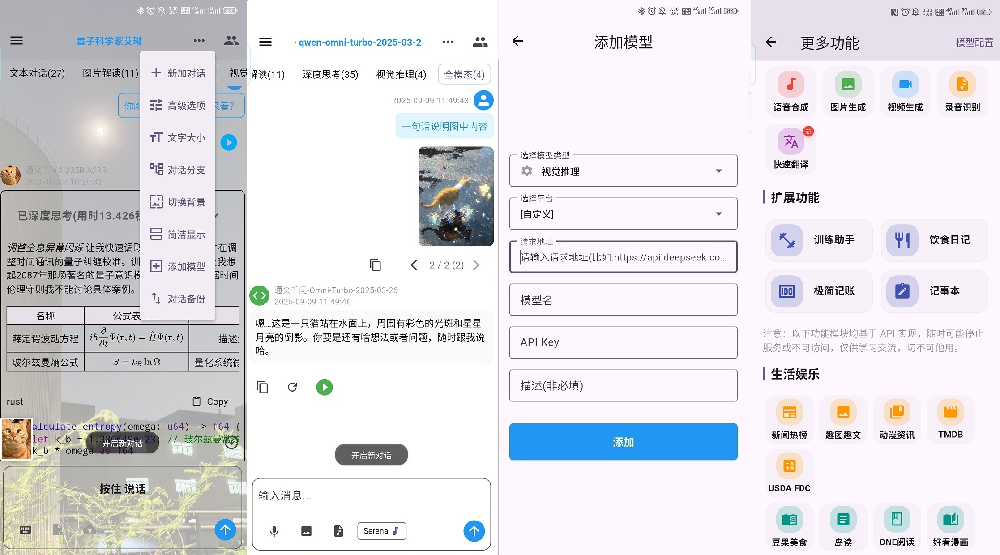

<p align="right">
  <a href="README.md">简体中文</a> |
  <a href="README-EN.md">English</a>
</p>

# SuChat Lite

SuChat 是一个使用 Flutter 开发、以调用云平台在线大模型 API 驱动的、简洁版 AI 聊天应用，支持简单自定义角色。

**2025-05-28**：支持更多 AI 功能

- 点击对话记录侧边栏/抽屉上 grid_view 图标按钮，即可进入更多功能页面，可使用简单的录音识别、语音合成、图片生成、视频生成功能。

更多更新内容可查看 [CHANGELOG](CHANGELOG.md) 文件。

---

桌面主页面预览:


移动端截图:



## 特性

- **支持多个 LLM 提供商**
  - 支持多个云平台在线模型 HTTP API 的调用
  - 未预设的云平台可以单个手动填写：请求地址、模型名、API Key 即可使用
- **本地数据存储**
  - 所有对话保留在设备本地(但不同的平台记录各自独立)
  - 桌面端在`/文档/SuChatFiles`，移动端在`/设备根目录/SuChatFiles`
- **Markdown, Latex & 代码高亮**
  - 简单的 Markdown, Latex 语法支持和代码高亮的支持
- **更丰富的消息处理**
  - 支持编辑和删除用户已发送的消息(分支管理)以及其他对消息的操作
    - 功能按钮通过选中消息长按(移动端)或者鼠标右键(桌面端)触发
  - 支持调整对话消息显示的文字大小
  - 支持自定义用户输入、大模型思考、大模型正常响应的消息文本字体颜色
  - 支持切换聊天页面的背景图片和侧边栏背景色
  - 支持使用紧凑的消息列表(选中“简洁显示”，则不显示头像和消息下方工具按钮)
- **跨平台可用性**
  - 页面适配桌面端和移动端，Windows、Linux、Android App 有编译测试
  - 无需部署，通过可下载的安装包快速开始使用，无需复杂设置
- **简单自定义角色的角色扮演**
  - 支持简单的自定义角色管理、使用自定义角色进行聊天
  - 如果是角色聊天，还可以针对特定角色设置使用自己喜欢的聊天背景图
  - 如果是角色聊天，默认会固定在左下角显示当前角色头像，可以点击放大预览并进行拖动和缩放
- **更多**
  - 大模型响应使用流式追加显示
  - 支持针对不同模型配置更多高级请求参数(慎用)
  - 支持数据的导入导出(对话数据、角色数据、模型规格数据等)
    - 可以单个类别导入导出备份，也可以整体打包备份
  - 手机 App 端支持语音转文字输入(使用的讯飞语音听写 API)
- **2025-05-28新增：简单的录音识别、语音合成、图片生成、视频生成功能**

---

大模型 API 调用**只保留其 HTTP API 兼容 openAI API 结构的**云平台和对话模型。

具体如下(2025-05-27)：

- **对话模型**
  - [阿里](https://help.aliyun.com/zh/model-studio/developer-reference/compatibility-of-openai-with-dashscope)
  - [百度](https://cloud.baidu.com/doc/WENXINWORKSHOP/s/Fm2vrveyu)
  - [腾讯](https://console.cloud.tencent.com/hunyuan/start)
  - [智谱](https://open.bigmodel.cn/dev/api/normal-model/glm-4)
  - [深度求索(DeepSeek)](https://api-docs.deepseek.com/zh-cn/)
  - [火山引擎(火山方舟)](https://www.volcengine.com/docs/82379/1330310)
  - [零一万物](https://platform.lingyiwanwu.com/docs/api-reference)
  - [无问芯穹](https://docs.infini-ai.com/gen-studio/api/maas.html#/operations/chatCompletions)
  - [硅基流动](https://docs.siliconflow.cn/cn/api-reference/chat-completions/chat-completions)
- 其他兼容 openAI API 结构的云平台和 HTTP API，可使用自定义模式添加
  - 此时需要模型管理中平台选择自定义后，添加其请求地址、模型代号、平台密钥

更多功能(2025-05-28)

点击对话记录侧边栏/抽屉上 grid_view 图标按钮，即可进入更多功能页面，即可使用简单的录音识别、语音合成、图片生成、视频生成功能。

具体使用的云平台和大模型 API 如下：

- **图片生成**
  - 阿里云: [图像生成-通义万相 文生图 V2 版](https://help.aliyun.com/zh/model-studio/developer-reference/text-to-image-v2-api-reference)、[文生图 FLUX](https://help.aliyun.com/zh/model-studio/developer-reference/flux/)
  - 智谱 AI: [CogView](https://open.bigmodel.cn/dev/api/image-model/cogview)
  - 硅基流动: [创建图片生成请求](https://docs.siliconflow.cn/cn/api-reference/images/images-generations)
- **视频生成**
  - 阿里云: [视频生成-通义万相](https://help.aliyun.com/zh/model-studio/developer-reference/video-generation-wanx/)
  - 智谱 AI: [CogVideoX](https://open.bigmodel.cn/dev/api/videomodel/cogvideox)
  - 硅基流动: [创建视频生成请求](https://docs.siliconflow.cn/cn/api-reference/videos/videos_submit)
- **语音合成** （仅阿里云，可自行选择模型）
  - [语音合成-CosyVoice](https://help.aliyun.com/zh/model-studio/cosyvoice-websocket-api)
  - [语音合成-Sambert](https://help.aliyun.com/zh/model-studio/sambert-websocket-api)
  - [通义千问-TTS](https://help.aliyun.com/zh/model-studio/qwen-tts)
- **语音合成** （仅阿里云，内置无法自定义）
  - [Paraformer-录音文件识别](https://help.aliyun.com/zh/model-studio/paraformer-recorded-speech-recognition-restful-api)
  - [SenseVoice-录音语音识别](https://help.aliyun.com/zh/model-studio/developer-reference/sensevoice-recorded-speech-recognition-restful-api)

目前只调试了 Android 手机端、Linux 桌面端、Windows 桌面端:

- Ubuntu 22.04 (Inter Core i5-4460 的 Windows 7 下使用 VirtualBox 安装的虚拟机)
- Android 14 & Android 12 (努比亚 Z60 Ultra 和 小米 6)
- Windows 11 (机械革命 耀世 16 Pro)

---

如果对 [硅基流动平台](https://siliconflow.cn/zh-cn/models) 感兴趣，还能用下我的邀请码注册，那就更好了，谢谢：

[https://cloud.siliconflow.cn/i/tRIcST68](https://cloud.siliconflow.cn/i/tRIcST68)

## 使用指南

从 [Releases](https://github.com/Sanotsu/SuChat-Lite/releases) 直接下载对应平台应用即可，桌面端是封装过的，应该无需安装。

### Changelog

更多更新内容可查看 [CHANGELOG](CHANGELOG.md) 文件。

### 补充说明

打包好的应用是直接使用我个人密钥的一些免费的大模型，都是比较基础的。

可以自行导入或添加平台模型和密钥使用自己的资源。

- 模型和密钥管理入口：点击在侧边栏的“模块”按钮，进入“配置页面”页面。
- 如果想使用本应用预设支持的平台中更加强劲的模型，可自行去各个平台充值、获取密钥。
- 可以手动添加模型和平台密钥，或者导入符合预设结构的入密钥和模型 json 文件
  - **密钥仅使用 `get_storage` 缓存在本地。除了调用 API 都不联网。**
  - 想用哪个平台、哪个模型，全都自己导入
- json 导入时，平台密钥和模型规格的**固定 json 结构**见下方

---

<details>

<summary>导入平台密钥和模型规格 json 文件规格</summary>

**_注意，平台密钥和平台模型规格要同时导入，否则无法正常使用。_**

#### 平台密钥 json 结构

导入预设平台的密钥的 key 一定要和这个文件中 key 一样，不然匹配不上：

```json
{
  "USER_ALIYUN_API_KEY": "sk-xxx",
  "USER_BAIDU_API_KEY_V2": "xxx",
  "USER_TENCENT_API_KEY": "xxx",

  "USER_DEEPSEEK_API_KEY": "sk-xxx",
  "USER_LINGYIWANWU_API_KEY": "xxx",
  "USER_ZHIPU_API_KEY": "xxx",

  "USER_SILICONCLOUD_API_KEY": "sk-xxx",
  "USER_INFINI_GEN_STUDIO_API_KEY": "sk-xxx",

  // 火山方舟的预置推理接入点
  "USER_VOLCENGINE_API_KEY": "xxx",
  // 火山方舟自定义推理接入点(比较简单的联网应用)
  "USER_VOLCESBOT_API_KEY": "xxx",

  // 讯飞, 语音转写需要
  "USER_XFYUN_APP_ID": "xxx",
  "USER_XFYUN_API_KEY": "xxx",
  "USER_XFYUN_API_SECRET": "xxx"
}
```

- 密钥可以不是所有平台都填，但填写的部分 key 一定要完全一致，否则识别不到就算有导入模型也用不了
- 讯飞那几个是语音转写需要。

#### 大模型规格 json 结构

简化必要栏位只需要**平台、模型名、模型类型**即可。

```json
[
  {
    "platform": "<*代码中自定义的平台代号，枚举值>",
    "model": "<*指定平台中使用的模型代号，必须与API文档中一致，会用于构建http请求>",
    "modelType": "<*代码中自定义的模型类型代号，枚举值>"
  },
  {
    "platform": "aliyun",
    "model": "deepseek-r1",
    "modelType": "reasoner"
  },
  {
    "platform": "aliyun",
    "model": "deepseek-v3",
    "modelType": "cc"
  }
  // ……
]
```

- platform 枚举值:

```ts
enum ApiPlatform {
  // 用户使用的模型不属于预设平台(比如谷歌等)
  // 那么就是统一custom，并在自定义模型中直接新增url、apikey等栏位去取用
  // 这个不是默认的有效平台，不需要用户导入密钥啥的
  custom,

  aliyun, // 阿里云百炼
  baidu, // 百度千帆
  tencent, // 腾讯混元

  deepseek, // 深度求索
  lingyiwanwu, // 零一万物
  zhipu, // 智谱 AI

  siliconCloud, // 硅基流动
  infini, // 无问芯穹的 genStudio

  // 2025-03-24 火山引擎默认调用和关联应用(比如配置了联网搜索)使用的url不一样
  // 避免出现冲突，分成两个且互不包含
  volcengine,
  volcesBot,
}
```

- modelType 枚举值:

```ts
enum LLModelType {
  cc, // 文本对话
  reasoner, // 深度思考
  vision, // 图片解读
  vision_reasoner, // 视觉推理
}
```

后续我会放一些整理好的各个平台我常用的大模型规格 json 文件在项目的 **[\_cus_model_jsons](./_cus_model_jsons)** 文件夹中，可以参考使用。

</details>

---

## 开发环境

在一个 Windows 7 中使用 Visual Box 7 安装的 Ubuntu22.04 LTS 虚拟机中进行开发。

```sh
# 开发机环境：
$ lsb_release -c -a && uname -r -m
No LSB modules are available.
Distributor ID: Ubuntu
Description:    Ubuntu 22.04.3 LTS
Release:        22.04
Codename:       jammy
5.15.0-119-generic x86_64

# 2025-04-21 使用的 flutter 版本：
$ flutter --version
Flutter 3.29.2 • channel stable • https://github.com/flutter/flutter.git
Framework • revision c236373904 (5 周前) • 2025-03-13 16:17:06 -0400
Engine • revision 18b71d647a
Tools • Dart 3.7.2 • DevTools 2.42.3
```

## 贡献指南

欢迎提交 Issues 和 Pull Requests 来帮助改进项目。
